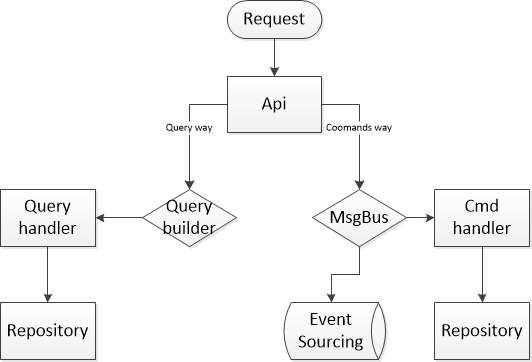
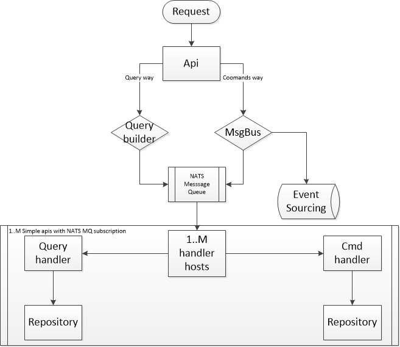

# Getting started

The project aims to quickly configure the CQRS architecture.
There are two settings ways:
1. unallocated
2. distributed

Additionally you can use libraries for:
1. DataMapping
2. DataAccess
3. Logging
4. Functional extensions
5. Specifications
6. DDD 

Ioc config helper you can find [here](docs/ProjectBuilder.cs)
All projects has nuget packages, all of them starts with: In.Infrastructure


## Unallocated way

There are 1..M process with api/handlers:
User send request to api ->
Api receives a request ->
Api sends requests to message bus and/or query builder ->
business logic in query/command handlers



### Settings example

We crate our own ProjectBuilder from [here](docs/ProjectBuilder.cs) and use methods in our startup file

```c#
services.AddCommonServices()	// required: for query builder and message bus
.AddCqrsSimpleCommands()		// required: for command handlers
.AddCqrsSimpleQueries()			// required: for query handlers
.AddLoggingServices()			// optional: if you want ILogService
.AddDAEfCoreProviders()			// optional: if you have an ef db	(note: you need one of DA implementations for repositories)
.AddDAMongoProviders()			// optional: if you have moongo db	(note: you need one of DA implementations for repositories)
.AddDMAutomapper()				// optional: if you want to use automapper and projection queries
.AddAuth()						// optional: if you want to setting up athentification
```

## Distributed way

There are 1..M process with api:
User send request to api ->
Api receives a request ->
Api sends requests to message bus and/or query builder ->
Query builder/ Message bus wrapper sends it to MQ and subscribes for response ->
Free command/query handler host gets the message, parse it and send to  message bus and/or query builder ->
business logic in query/command handlers



### Settings example

We crate our own ProjectBuilder from [here](docs/ProjectBuilder.cs) and use methods in our startup file

Public api:
```c#
services.AddCommonServices()	// required: for query builder and message bus
.AddCqrsNatsCommandSender()		// required: for command sender
.AddCqrsNatsQueryBuilder()		// required: for query builder
.AddLoggingServices()			// optional: if you want ILogService
.AddDAEfCoreProviders()			// optional: if you have an ef db	(note: you need one of DA implementations for repositories)
.AddDAMongoProviders()			// optional: if you have moongo db	(note: you need one of DA implementations for repositories)
.AddDMAutomapper()				// optional: if you want to use automapper and projection queries
.AddAuth()						// optional: if you want to setting up athentification
```

Private api:
```c#
services.AddCommonServices()	// required: for query builder and message bus
.AddCqrsNatsCommandHandlers()	// required: for nats commands handlers
.AddCqrsNatsQueryHandler()		// required: for nats query handlers
.AddLoggingServices()			// optional: if you want ILogService
.AddDAEfCoreProviders()			// optional: if you have an ef db	(note: you need one of DA implementations for repositories)
.AddDAMongoProviders()			// optional: if you have moongo db	(note: you need one of DA implementations for repositories)
.AddDMAutomapper()				// optional: if you want to use automapper and projection queries
.AddAuth()						// optional: if you want to setting up athentification
```

# Other features

## In.Specifications

There are implemented specification pattern
Used for:
1. specification queries
2. repository specification query
3. GenericQueryBuilder (common query way without custom query handler implementation)

## In.FunctionalCSharp

Use for functional code
I always use it for commands way

## In.Auth.Identity.Server

Use to make your own identity server

## In.Web
Use for api helpers and errors wrapper

# Service configuration

Configurations:
1. In.Common:
  _ There are services and helpers _
 Ioc method: **AddCommonServices**
 
 Adds:
 - IDiScope:      service locator
 - ITypeFactory:  try to get Type be string
 Helpers:
 - AsyncHelpers:  runs task in the sync mode
 - IocExtensions: extensions for Ioc:
      RegisterAssemblyImplementationsScoped,
      RegisterAssemblyImplementationsSingleton,
      AddScopedGenerics`
      
2. In.Web:
  There are services and middleware
  Ioc method: **AddWebServices**
  Adds:
  - IUserContextService:  uses in controller for getting user data
  
  Middleware method: **UseErrorsMiddleware**
  - Unhandled exceptions wrapper
3. In.Auth:
  There are configuration extensions:
    - AddAuth

3. In.Specifications
  There are Specification pattern and a helper:
  **Specifications** - Main functional class, have and/or/not implementations
  **Utility** - helpers

4. In.Logging
  There are services for logging
  Ioc method: **AddLoggerServices**
  Add:
    - ILogService: logging methods
    
5. In.FunctionalCSharp
  There are Functional extensions for business logic
  **Result** - Main functional class
  
6. In.DDD (**Not ready yet!**)
  There are domain UOW / Repo / Dispatcher / Event Handlers
  Ioc method: DddModuleBuilder.AddServices
  We recommend you to use it only on "Commands Way" because of performance

7. In.DataMapping
  There are IMapperService abstraction only
  **Implementations libs**:
    - In.DataMapping.Automapper
  
8. In.DataAccess
  There are abstractions for Domain like IHasKey
  Repositury abstractions:
    - IDatasetUow
    - ILinqProvider
    - IRepository
    
  **Implementations libs**:
    - In.DataAccess.EfCore
    - In.DataAccess.Mongo
    
9. In.Cqrs.Command
  There are abstractions for commands and handlers
  Abstractions:
    - ICommandHandler
    - IMessage
    - IMessageResult
    - IMessageSender
  
  **Implementations libs**:
    - In.Cqrs.Command.Simple
        There are simple in proccess message bus
        Ioc ext: **AddCommandServices** - registres:
          - IMessageResult
          - SimpleMsgBus
          - Lookup for handlers in assemblies in param
    - In.Cqrs.Command.Nats
        There are implementations for NatsMsgBus and queue & reply implementations
        
10. In.Cqrs.Query
    There are abstractions for commands and handlers
    Abstractions:
      - ICriterion
      - IQueryBuilder
      - IQueryFactory
      - IQueryFor
      - IQueryHandler
      - IGenericQuery
      - IGenericQueryBuilder
      - ISingleQueryResult
      - IMultipleQueryResult
      
     **Implementations libs**:
     - In.Cqrs.Query.Simple
      There are simple im process message handlers
     - In.Cqrs.Query.Nats
      There are Nats query handlers implementations for a master and a slave
      
11. In.Auth.Identity.Server
	There are Configuration and services for indetity server
	Abstractions:
		- ISigninService
		- ITokenService
		
	AuthException - custom exceptions from services
	

## Settings summary

To simplify the understanding of the settings, I created a general builder, the methods of which you can copy to your project
You can find the settings file [here](docs/ProjectBuilder.cs)

```c#
	public class ProjectBuilder
    {
        private readonly IServiceCollection _collection;

        public ProjectBuilder(IServiceCollection collection)
        {
            _collection = collection;
        }
        
        /// <summary>
        /// Adds common services
        /// </summary
        /// <returns></returns>
        public IServiceCollection AddCommonServices()
        {
            var builder = new CommonModuleBuilder(_collection);
            return builder.AddServices();
            
        }

        /// <summary>
        /// Add logging services
        /// </summary>
        /// <returns></returns>
        public IServiceCollection AddLoggingServices()
        {
            var builder = new LoggingModuleBuilder(_collection);
            return builder.AddServices();
        }
        
        /// <summary>
        /// Add ddd services
        /// </summary>
        /// <param name="assemblies">assemblies with ddd repositories and event handlers</param>
        /// <returns></returns>
        public IServiceCollection AddDDD(Assembly[] assemblies)
        {
            var builder = new DddModuleBuilder(_collection, assemblies);
            return builder.AddServices();
        }

        /// <summary>
        /// Add identity server connection settings
        /// </summary>
        /// <param name="settings"></param>
        /// <returns></returns>
        public IServiceCollection AddAuth(AuthenticationSettings settings)
        {
            var builder = new AuthModuleBuilder(_collection, settings);
            return builder.AddServices();
        }

        /// <summary>
        /// Add identity server settings
        /// </summary>
        /// <param name="optionsBuilder">db context builder</param>
        /// <typeparam name="TUser">Type of identity user</typeparam>
        /// <typeparam name="TCtx">Ef db context type</typeparam>
        /// <returns></returns>
        public IServiceCollection AddIdentityServer<TUser, TCtx>(Action<DbContextOptionsBuilder> optionsBuilder)
            where TUser : IdentityUser where TCtx : DbContext
        {
            var builder = new IdentityServerModuleBuilder<TUser, TCtx>(_collection, optionsBuilder);
            return builder.AddServices();
        }

        /// <summary>
        /// Add command sender and handlers
        /// </summary>
        /// <param name="handlersAssemblies">commands handlers assemblies</param>
        /// <typeparam name="TMsgResult"></typeparam>
        /// <returns></returns>
        public IServiceCollection AddCqrsSimpleCommands<TMsgResult>(Assembly[] handlersAssemblies)
            where TMsgResult : class, IMessageResult
        {
            var builder = new SimpleCommandModuleBuilder<TMsgResult>(_collection, handlersAssemblies);
            return builder.AddServices();
        }

        /// <summary>
        /// Add query sender and handlers
        /// </summary>
        /// <param name="handlersAssemblies">query handlers assemblies</param>
        /// <returns></returns>
        public IServiceCollection AddCqrsSimpleQueries(Assembly[] handlersAssemblies)
        {
            var builder = new SimpleQueryModuleBuilder(_collection, handlersAssemblies);
            return builder.AddServices();
        }
        
        /// <summary>
        /// Add NATS settings
        /// </summary>
        /// <param name="natsSettings"></param>
        /// <typeparam name="TMsgResult"></typeparam>
        /// <returns></returns>
        public IServiceCollection AddCqrsNats(NatsSenderOptions natsSettings)
        {
            var builder = new NatsModuleBuilder(_collection, natsSettings);
            return builder.AddServices();
        }

        /// <summary>
        /// Add NATS command sender
        /// </summary>
        /// <typeparam name="TMsgResult"></typeparam>
        /// <returns></returns>
        public IServiceCollection AddCqrsNatsCommandSender<TMsgResult>()
            where TMsgResult : class, IMessageResult
        {
            var builder = new NatsCommandMasterModuleBuilder<TMsgResult>(_collection);
            return builder.AddServices();
        }

        /// <summary>
        /// Add NATS command handlers
        /// </summary>
        /// <param name="natsSettings"></param>
        /// <returns></returns>
        public IServiceCollection AddCqrsNatsCommandHandlers()
        {
            var builder = new NatsCommandSlaveModuleBuilder(_collection);
            return builder.AddServices();
        }

        /// <summary>
        /// Add NATS query builder
        /// </summary>
        /// <returns></returns>
        public IServiceCollection AddCqrsNatsQueryBuilder()
        {
            var builder = new NatsQueryMasterModuleBuilder(_collection);
            return builder.AddServices();
        }

        /// <summary>
        /// Add NATS query handlers
        /// </summary>
        /// <returns></returns>
        public IServiceCollection AddCqrsNatsQueryHandler()
        {
            var builder = new NatsQuerySlaveModuleBuilder(_collection);
            return builder.AddServices();
        }

        /// <summary>
        /// Add ef core providers
        /// </summary>
        /// <param name="repositoryAssemblies"></param>
        /// <typeparam name="TCtx">Ef db context type</typeparam>
        /// <returns></returns>
        public IServiceCollection AddDAEfCoreProviders<TCtx>(Assembly[] repositoryAssemblies) where TCtx : DbContext
        {
            var builder = new DataAccessEfCoreModuleBuilder<TCtx>(_collection, repositoryAssemblies);
            return builder.AddServices();
        }
        
        /// <summary>
        /// Add providers for mongo da
        /// </summary>
        /// <param name="repositoryAssemblies"></param>
        /// <returns></returns>
        public IServiceCollection AddDAMongoProviders(Assembly[] repositoryAssemblies)
        {
            var builder = new DataAccessMongoModuleBuilder(_collection, repositoryAssemblies);
            return builder.AddServices();
        }

        /// <summary>
        /// Add automapper mappings
        /// </summary>
        /// <param name="assembliesWithProfile"></param>
        /// <returns></returns>
        public IServiceCollection AddDMAutomapper(Assembly[] assembliesWithProfile)
        {
            var builder = new DataMappingAutomapperModuleBuilder(_collection, assembliesWithProfile);
            return builder.AddServices();
        }
    }
```

